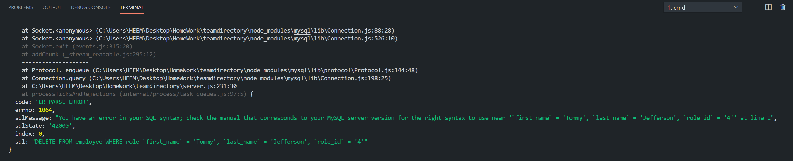
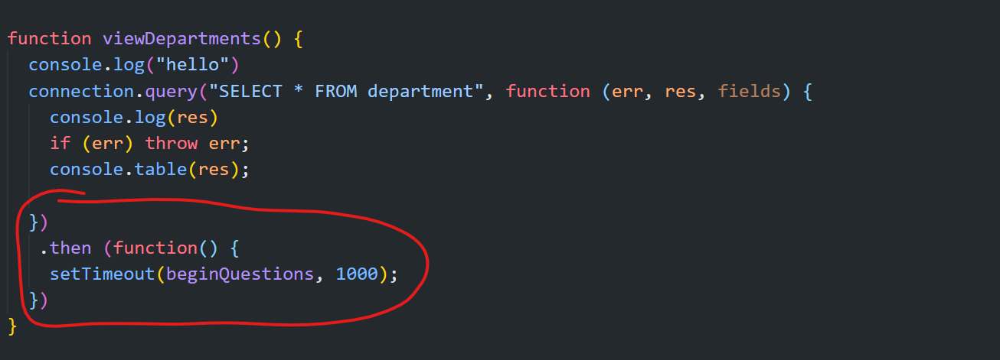

## Team Directory Tracker

[Database Work Video Link](https://youtu.be/jAVGsukErWk)

**Description**

The Team Directory Tracker allows the user to go into the database to view, add or make changes. 

Features:

- User has the ability to View all Departments and Employees
- User has the ability to Vill all of the active Employees
- User has the ability to make changes to database: add/remove
- User can view the managers in the database

## The Finished Product 

[Database Work Video Link](https://youtu.be/jAVGsukErWk)

## Challenges :loudspeaker:

1. Wasn't able to get the remove employee selection, I believe the problem is with the query selector syntax using "DELETE" did some trial an error couldn't quite get it. [Remove Employee Challenge](https://youtu.be/aFW3423M9ps)

Snapshot of what I get in the terminal

2. The view manager selection gave me an issue, because the manager had a FOREIGNKEY because the manager is an employee but not group with the other employees.

3. After selecting "View Departments" the departments display, it doesn't loop back to the questions? I tried using a setTime to call the function, right after the view departments code. 

## Author :zap:

Ernest Wesson 

## Credits :star:

Slack: Study Group #3

Lofi Music: https://www.youtube.com/watch?v=tutZKLeGrCs

## License :page_with_curl:

MIT License

Copyright (c) [2020] [Ernest]

Permission is hereby granted, free of charge, to any person obtaining a copy of this software and associated documentation files (the "Software"), to deal in the Software without restriction, including without limitation the rights to use, copy, modify, merge, publish, distribute, sublicense, and/or sell copies of the Software, and to permit persons to whom the Software is furnished to do so, subject to the following conditions:

The above copyright notice and this permission notice shall be included in all copies or substantial portions of the Software.

THE SOFTWARE IS PROVIDED "AS IS", WITHOUT WARRANTY OF ANY KIND, EXPRESS OR IMPLIED, INCLUDING BUT NOT LIMITED TO THE WARRANTIES OF MERCHANTABILITY, FITNESS FOR A PARTICULAR PURPOSE AND NONINFRINGEMENT. IN NO EVENT SHALL THE AUTHORS OR COPYRIGHT HOLDERS BE LIABLE FOR ANY CLAIM, DAMAGES OR OTHER LIABILITY, WHETHER IN AN ACTION OF CONTRACT, TORT OR OTHERWISE, ARISING FROM, OUT OF OR IN CONNECTION WITH THE SOFTWARE OR THE USE OR OTHER DEALINGS IN THE SOFTWARE.

https://choosealicense.com/licenses/mit/